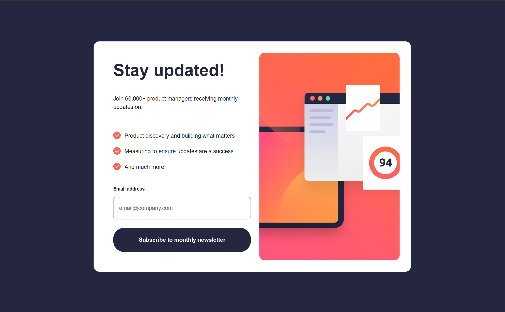

# 📢 Newsletter Sign-up Form with Success Message

This project is a **Frontend Mentor challenge** that involves building a **responsive newsletter sign-up form** with real-time email validation and a success message. The goal was to replicate the given design as closely as possible while ensuring functionality across different screen sizes.



---

## **📌 Challenge Overview**

The challenge required users to be able to:
- ✅ Add their email and submit the form.
- ✅ See a success message with their email after submitting the form.
- ✅ Receive form validation messages if:
  - The field is left empty.
  - The email address is not formatted correctly.
- ✅ View an optimal layout depending on their device's screen size.
- ✅ See hover and focus states for all interactive elements.

This project was completed as part of a **Frontend Mentor challenge**.

---

## **🛠️ Technologies Used**
- **HTML5** → For structuring the newsletter form and success message.
- **CSS3** → Used **CSS Grid** and **Flexbox** for responsive layouts.
- **JavaScript (ES6)** → Handled email validation and UI interactions.

---

## **🚀 Features & Functionality**

- **Form Validation:**
  - Uses HTML5 **`<form>`**, **`<input>`**, and **`type="email"`** to validate emails.
  - Displays an **error message** when the field is empty or incorrectly formatted.
  - Prevents submission unless the email format is correct.
  
- **Interactive Elements:**
  - Uses **CSS pseudo-classes** like `:hover`, `::after`, `:focus`, `:invalid`, and `:not`.
  - Shows a **red border and error message** when an invalid email is entered.
  - Uses JavaScript to **add/remove the `.hide` class** to toggle between the form and success message.

- **Responsive Design:**
  - Fully optimized for **mobile, tablet, and desktop** views.
  - Uses **CSS Grid** and **Flexbox** for an adaptive layout.

---

## **💡 Challenges & Learnings**

### **🔴 Biggest Challenge**

The most difficult part was integrating **HTML, CSS, and JavaScript** to handle **email validation** properly. Initially, it was unclear how to:
- Display an **error message** only when necessary.
- Highlight the input field **in red** when an email is invalid.
- Prevent submission until a **valid email** was entered.

### **📚 What I Learned**
- How to use **regex for email validation**.
- Improved understanding of **JavaScript DOM manipulation**.
- Learned about **`.add()` and `.remove()`** methods in JavaScript.
- Mastered **CSS pseudo-classes** like `:focus` and `:invalid`.

### **🔄 Debugging Experience**
- **Initially struggled** because I didn’t realize the **`<form>`** element was needed for built-in validation.
- **Revamped the entire codebase** to implement **proper validation and styling techniques**.
- Integrated **regex validation** to ensure emails matched correct formatting.

---

## **📂 How to Run the Project**

1. **Clone the repository:**
   ```sh
   git clone https://github.com/jayco01/newsletter-signup-success.git
   ```
2. **Open `index.html` in a browser** (No installation needed).

---

## **🌍 Live Demo**

🚀 **View the live project here:**  
🔗 [Newsletter Sign-up Form](https://jayco01.github.io/newsletter-signup-success/)

---